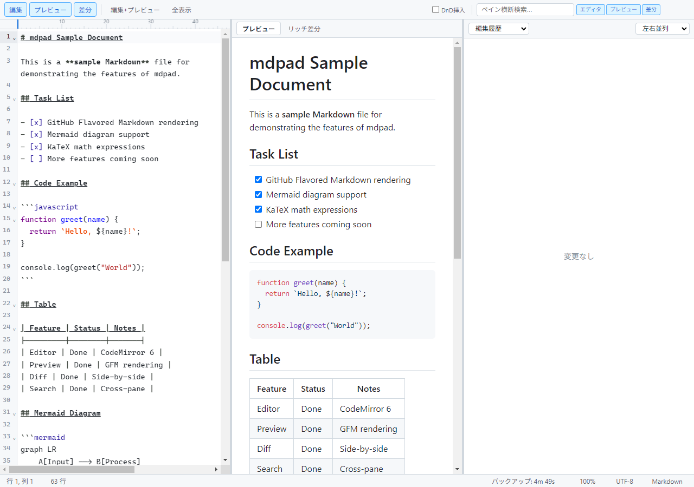
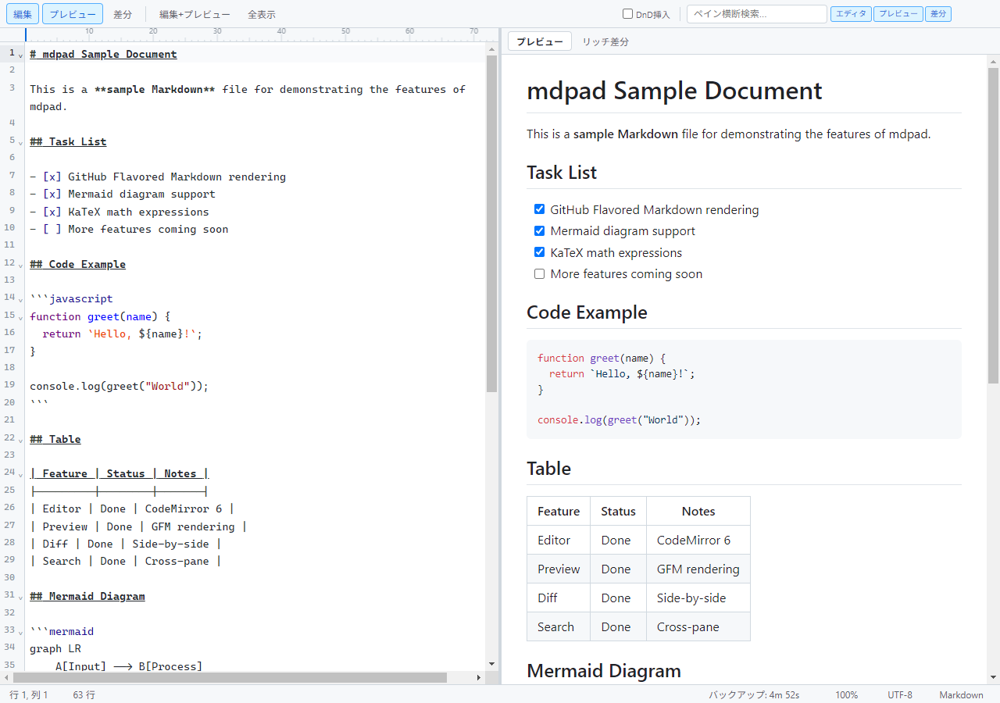
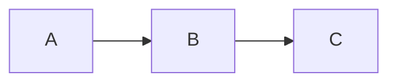
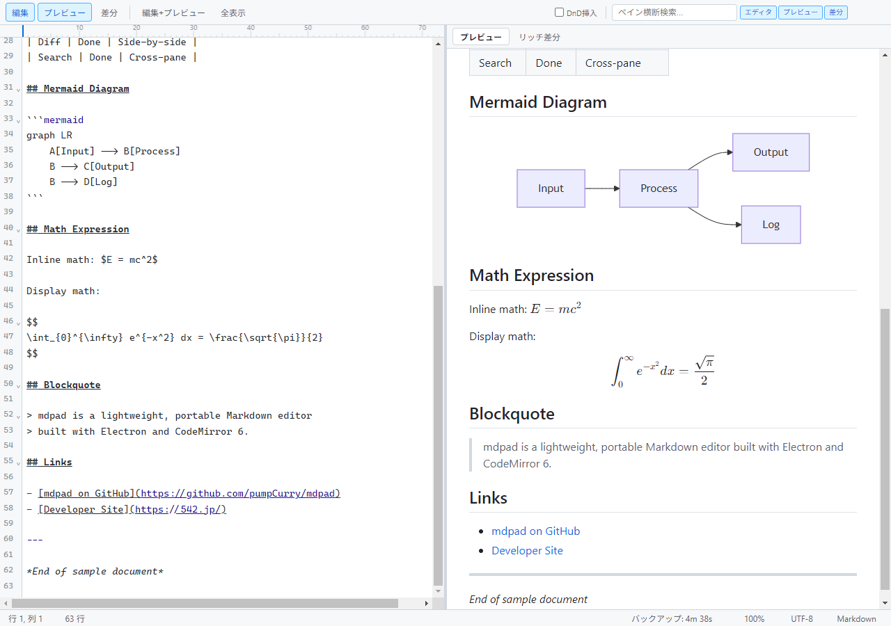
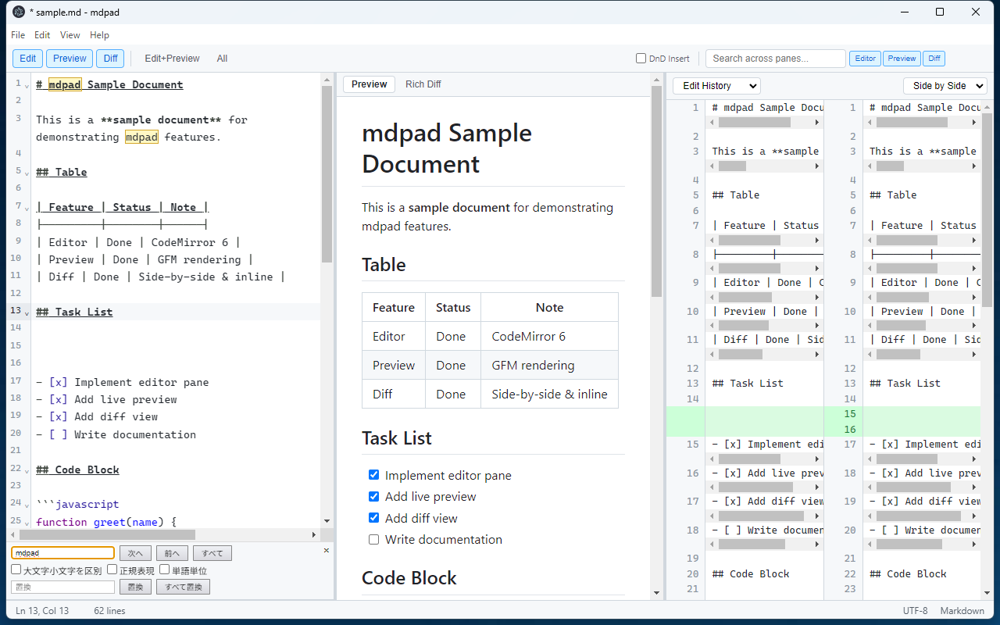
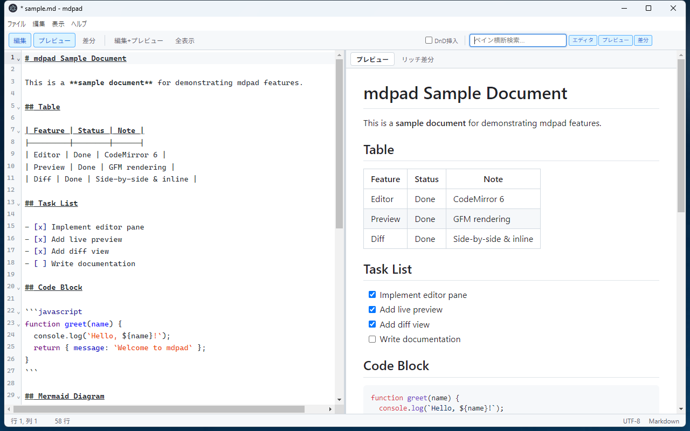
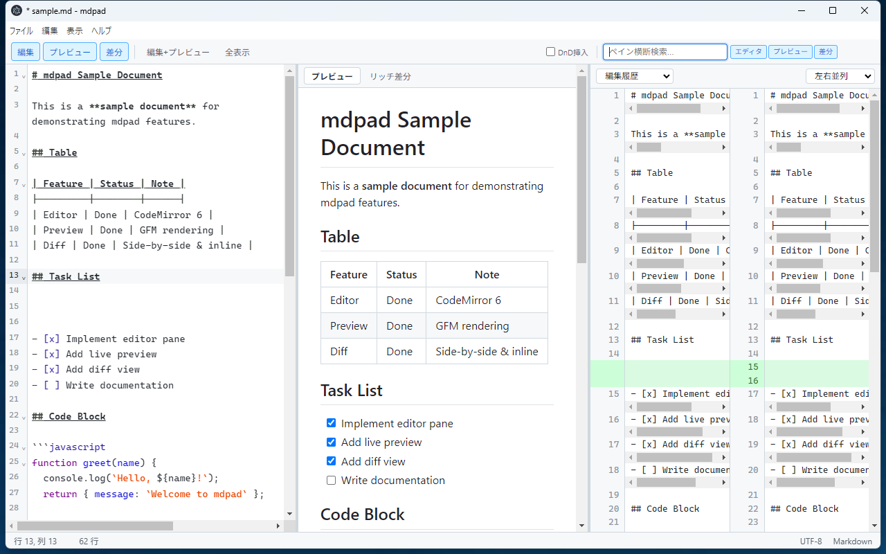

<p align="center">
  
</p>

# mdpad User Guide

A comprehensive guide to **mdpad** -- a portable, GitHub-flavored Markdown editor with live preview, diff comparison, and crash recovery. Built with Electron and CodeMirror 6.

---

## Table of Contents

- [Introduction](#introduction)
- [Installation and Launch](#installation-and-launch)
  - [Portable ZIP (Recommended)](#portable-zip-recommended)
  - [Build from Source](#build-from-source)
- [Screen Layout](#screen-layout)
  - [Toolbar](#toolbar)
  - [Editor Pane](#editor-pane)
  - [Preview Pane](#preview-pane)
  - [Diff Pane](#diff-pane)
  - [Status Bar](#status-bar)
- [Basic Operations](#basic-operations)
  - [New File](#new-file)
  - [Open File](#open-file)
  - [Save and Save As](#save-and-save-as)
  - [Close and Save Confirmation](#close-and-save-confirmation)
- [Editor Features](#editor-features)
  - [Markdown Syntax Highlighting](#markdown-syntax-highlighting)
  - [Line Numbers and Code Folding](#line-numbers-and-code-folding)
  - [Word Wrap Toggle](#word-wrap-toggle)
  - [Auto-close Brackets](#auto-close-brackets)
  - [Rectangular Selection](#rectangular-selection)
  - [80-Column Ruler](#80-column-ruler)
- [Preview Pane](#preview-pane-1)
  - [GFM Rendering](#gfm-rendering)
  - [Mermaid Diagrams](#mermaid-diagrams)
  - [KaTeX Math](#katex-math)
  - [Syntax-Highlighted Code Blocks](#syntax-highlighted-code-blocks)
  - [Scroll Sync](#scroll-sync)
  - [Rich Diff Mode](#rich-diff-mode)
- [Diff Pane](#diff-pane-1)
  - [Edit History Mode](#edit-history-mode)
  - [File Compare Mode](#file-compare-mode)
  - [Side-by-Side and Inline View](#side-by-side-and-inline-view)
- [Layout Switching](#layout-switching)
  - [Pane Toggle Buttons](#pane-toggle-buttons)
  - [Preset Layouts](#preset-layouts)
  - [Keyboard Shortcuts for Panes](#keyboard-shortcuts-for-panes)
  - [Drag Resize Handles](#drag-resize-handles)
- [Search and Replace](#search-and-replace)
  - [Find Panel](#find-panel)
  - [Replace Panel](#replace-panel)
  - [Search Options](#search-options)
  - [Match Count and Replace Feedback](#match-count-and-replace-feedback)
- [Cross-Pane Search](#cross-pane-search)
  - [Global Search Input](#global-search-input)
  - [Scope Toggles](#scope-toggles)
  - [Highlight and Hit Count](#highlight-and-hit-count)
- [Drag and Drop](#drag-and-drop)
  - [Default Behavior (DnD Insert OFF)](#default-behavior-dnd-insert-off)
  - [DnD Insert ON](#dnd-insert-on)
  - [Toggle Checkbox](#toggle-checkbox)
- [Auto Backup](#auto-backup)
  - [Configuring the Timer](#configuring-the-timer)
  - [Multi-Instance Safety](#multi-instance-safety)
- [Crash Recovery](#crash-recovery)
  - [How It Works](#how-it-works)
  - [Recovery Dialog](#recovery-dialog)
- [Language Switching](#language-switching)
  - [Changing the Language](#changing-the-language)
  - [Automatic Locale Detection](#automatic-locale-detection)
- [Keyboard Shortcuts](#keyboard-shortcuts)

---

## Introduction

mdpad is a lightweight, portable Markdown editor for Windows. It is designed for writers and developers who want a fast, distraction-free editing experience with a live preview that faithfully renders GitHub-Flavored Markdown (GFM).

Key features at a glance:

- **Live Preview** -- GFM-compatible rendering with tables, task lists, footnotes, Mermaid diagrams, and KaTeX math formulas.
- **Diff Comparison** -- View your editing history or compare against an external file, in side-by-side or inline mode.
- **Rich Diff** -- A rendered, GitHub-style diff view in the Preview pane that highlights added and removed content visually.
- **Cross-Pane Search** -- Search across the editor, preview, and diff panes simultaneously.
- **Auto Backup and Crash Recovery** -- Periodic backups and session-based crash recovery to protect your work.
- **Portable** -- No installation required. Extract the ZIP and run.
- **Multilingual** -- English and Japanese UI, with automatic OS locale detection.

---

## Installation and Launch

### Portable ZIP (Recommended)

1. Download the latest `mdpad-vX.X.XXXXX-win-x64-portable.zip` from the [releases page](https://github.com/pumpCurry/mdpad/releases).
2. Extract the ZIP to any folder (e.g., `C:\Tools\mdpad\`).
3. Double-click `mdpad.exe` to launch.

No installation or administrator privileges are required. You can run mdpad directly from a USB drive.

### Build from Source

If you want to build mdpad yourself:

1. Make sure you have [Node.js](https://nodejs.org/) (v18 or later) installed.
2. Clone the repository and install dependencies:
   ```
   git clone https://github.com/pumpCurry/mdpad.git
   cd mdpad
   npm install
   ```
3. To run in development mode:
   ```
   npm run dev
   ```
4. To build a portable directory:
   ```
   npm run build
   ```
5. To build and create a ZIP archive:
   ```
   npm run build:zip
   ```

The built application will be placed in the `build/win-unpacked/` folder.

---

## Screen Layout

The mdpad window is divided into four main areas: the **Toolbar** at the top, up to three **Panes** in the center (Editor, Preview, Diff), and the **Status Bar** at the bottom.



### Toolbar

The toolbar sits at the top of the window and contains:

- **Pane toggle buttons** -- `Edit`, `Preview`, `Diff` to show or hide individual panes.
- **Preset buttons** -- `Edit+Preview` and `All` for quick layout presets.
- **DnD Insert toggle** -- A checkbox that controls drag-and-drop behavior (see [Drag and Drop](#drag-and-drop)).
- **Cross-pane search** -- A search input with scope toggle buttons (see [Cross-Pane Search](#cross-pane-search)).

### Editor Pane

The left-most pane is a full-featured code editor powered by CodeMirror 6. It provides Markdown syntax highlighting, line numbers, code folding, and more. This is where you write and edit your Markdown content.

### Preview Pane

The center pane renders your Markdown in real time using GitHub-Flavored Markdown styling. It has two tabs:

- **Preview** -- Standard live rendering.
- **Rich Diff** -- A rendered diff view comparing current content against the original or an external file.

### Diff Pane

The right-most pane shows a source-level text diff. It has two modes:

- **Edit History** -- Compares the current content against the content at the time the file was last opened or saved.
- **File Compare** -- Compares the current content against an external file of your choice.

Both modes support side-by-side and inline views.

### Status Bar

The status bar at the bottom displays:

- **Cursor position** -- Current line and column (e.g., `Ln 42, Col 15`).
- **Selection info** -- Number of selected characters, shown when text is selected.
- **Total lines** -- The total line count of the document.
- **Backup countdown** -- Time remaining until next auto backup (e.g., `Backup: 4m 30s`), or `Backup: OFF` when disabled.
- **Zoom level** -- Current zoom percentage (e.g., `100%`).
- **Encoding** -- Always `UTF-8`.
- **File type** -- Always `Markdown`.

---

## Basic Operations

### New File

- **Menu:** File > New
- **Shortcut:** `Ctrl+N`

Creates a new, empty document. If the current document has unsaved changes, you will be prompted to save first.

### Open File

- **Menu:** File > Open...
- **Shortcut:** `Ctrl+O`

Opens a file dialog where you can select a Markdown file (`.md`, `.markdown`, `.mdown`, `.mkd`), text file (`.txt`), or any file type. If the current document has unsaved changes, you will be prompted to save first.

### Save and Save As

- **Save:** `Ctrl+S` -- Saves the current file. If the file is new and has never been saved, a Save As dialog appears.
- **Save As:** `Ctrl+Shift+S` -- Always opens a Save As dialog so you can choose a new file name or location.

### Close and Save Confirmation

When you close the window while the document has unsaved changes, mdpad shows an HTML-based confirmation dialog with three options:

| Button | Action |
|--------|--------|
| **Exit without saving** | Discards changes and closes. |
| **Save for resume & exit** | Saves session data for recovery on next launch, then closes. |
| **Save As** | Opens a Save As dialog, then closes. |

Pressing Escape or clicking outside the dialog keeps the window open.

---

## Editor Features

### Markdown Syntax Highlighting

mdpad uses CodeMirror 6 with the Markdown language mode. Headings, bold, italic, links, code blocks, and other Markdown elements are highlighted with distinct colors and styles for easy readability.

### Line Numbers and Code Folding

- **Line numbers** are displayed in the gutter on the left side of the editor.
- **Code folding** is available via the fold gutter (small arrows in the gutter). Click a fold arrow to collapse a section (e.g., a heading section or a fenced code block). Click again to expand.

### Word Wrap Toggle

- **Menu:** View > Toggle Word Wrap
- **Shortcut:** `Alt+Z`

Toggles word wrap on and off. When word wrap is enabled (the default), long lines wrap at the edge of the editor pane. When disabled, lines extend beyond the visible area and a horizontal scrollbar appears.

### Auto-close Brackets

- **Menu:** View > Auto-close Brackets

When enabled (the default), typing an opening bracket (`(`, `[`, `{`, `` ` ``, `"`, `'`) automatically inserts the matching closing bracket. This setting can be toggled via the View menu.

### Rectangular Selection

Hold `Alt` and drag the mouse to create a rectangular (column) selection. This is useful for editing multiple lines at the same position simultaneously.

### 80-Column Ruler

A dashed vertical line is drawn at the 80th column as a visual guide. This helps you keep your lines within a reasonable width, which is especially useful for documents that will be viewed in terminals or on platforms that expect 80-character line widths.

---

## Preview Pane



### GFM Rendering

The Preview pane renders your Markdown using a GitHub-Flavored Markdown (GFM) compatible engine. Supported features include:

- **Tables** -- Pipe-delimited tables with alignment support.
- **Task lists** -- Checkboxes using `- [ ]` and `- [x]` syntax.
- **Footnotes** -- Using `[^1]` reference syntax.
- **HTML** -- Inline HTML is supported and sanitized for safety.
- **Autolinks** -- URLs are automatically converted to clickable links.

### Mermaid Diagrams

Fenced code blocks with the language `mermaid` are automatically rendered as diagrams. For example:

````

````

Supported diagram types include flowcharts, sequence diagrams, Gantt charts, class diagrams, and more. Diagram renderings are cached for performance. If a diagram contains a syntax error, an error message is displayed in place of the diagram.

### KaTeX Math

Mathematical formulas are rendered using KaTeX. Two delimiters are supported:

- **Inline math:** `$E = mc^2$` renders as an inline formula.
- **Display math:** `$$\int_0^\infty e^{-x} dx = 1$$` renders as a centered block formula.



### Syntax-Highlighted Code Blocks

Fenced code blocks with a language identifier are syntax-highlighted using highlight.js. For example:

````
```javascript
function greet(name) {
  return `Hello, ${name}!`;
}
```
````

If no language is specified, highlight.js will attempt to auto-detect the language.

### Scroll Sync

The Preview pane scrolls in sync with the editor. As you scroll through the editor, the preview automatically follows to show the corresponding rendered content. This mapping uses source line attributes for accurate positioning, with a proportional fallback for unmapped regions.

### Rich Diff Mode

Click the **Rich Diff** tab in the Preview pane header to switch to Rich Diff mode. This shows a GitHub-style rendered diff where added content is highlighted in green and removed content is highlighted in red.

Two comparison sources are available via the dropdown:

- **vs. Original** -- Compares the current content against the state when the file was opened or last saved.
- **vs. File** -- Compares the current content against an external file. Click the **Open File...** button to select a file.

---

## Diff Pane

### Edit History Mode

Select **Edit History** from the dropdown at the top of the Diff pane. This mode shows a source-level text diff comparing the current editor content against the original content (the state when the file was opened or last saved). This is useful for reviewing your changes before saving.

### File Compare Mode

Select **File Compare** from the dropdown. Then click the **Open File...** button to choose an external file to compare against. The diff updates automatically as you continue editing.

### Side-by-Side and Inline View

Use the view mode dropdown on the right side of the Diff pane toolbar:

- **Side by Side** -- Displays the old and new content in two columns, with additions and deletions aligned for easy comparison.
- **Inline** -- Displays a unified diff where additions and deletions are shown in a single column with color coding.


---

## Layout Switching

### Pane Toggle Buttons

The toolbar contains three toggle buttons: **Edit**, **Preview**, and **Diff**. Clicking a button shows or hides the corresponding pane. At least one pane must always be visible -- the last visible pane cannot be hidden.

Active (visible) panes are indicated by a highlighted button state.

### Preset Layouts

Two preset buttons provide quick access to common layouts:

- **Edit+Preview** -- Shows the Editor and Preview panes side by side (hides Diff).
- **All** -- Shows all three panes (Editor, Preview, and Diff).

### Keyboard Shortcuts for Panes

- `Ctrl+1` -- Toggle the Editor pane.
- `Ctrl+2` -- Toggle the Preview pane.
- `Ctrl+3` -- Toggle the Diff pane.

### Drag Resize Handles

Between adjacent visible panes, a resize handle appears as a thin vertical bar. Click and drag the handle to resize the panes. Each pane has a minimum width of 100 pixels.

---

## Search and Replace



### Find Panel

- **Menu:** Edit > Find...
- **Shortcut:** `Ctrl+F`

Opens the search panel at the top of the editor. Type your search query to highlight all matches in the document. Use the **next** and **previous** buttons (or press `Enter` / `Shift+Enter`) to navigate between matches.

### Replace Panel

- **Menu:** Edit > Replace...
- **Shortcut:** `Ctrl+H`

Opens the search panel with the replace field visible. Enter your search query and replacement text, then use:

- **replace** -- Replaces the current match and advances to the next.
- **replace all** -- Replaces all matches in the document at once.

### Search Options

The search panel provides three option toggles:

- **match case** -- When enabled, the search is case-sensitive.
- **by word** -- When enabled, only whole-word matches are found.
- **regexp** -- When enabled, the search query is treated as a regular expression.

### Match Count and Replace Feedback

The search panel displays a live match count (e.g., `5 hits`) that updates as you type or edit the document. After a replace operation, the panel briefly shows a message like `Replaced 3. 2 hits` indicating how many replacements were made and how many matches remain. This message reverts to the standard hit count after 5 seconds.

---

## Cross-Pane Search


### Global Search Input

The cross-pane search bar is located at the right side of the toolbar. Type a search term to highlight all occurrences across the visible panes simultaneously. The search is case-insensitive. Press `Escape` to clear the search.

### Scope Toggles

Three toggle buttons next to the search input control which panes are searched:

- **Editor** -- Searches the raw Markdown source in the editor pane.
- **Preview** -- Searches the rendered text in the preview pane.
- **Diff** -- Searches the text in the diff pane.

Click a button to enable or disable searching in that pane. At least one scope must remain active.

### Highlight and Hit Count

Matches are highlighted with a colored background across all enabled panes. The total hit count from all panes is displayed next to the search input (e.g., `12 hits`). If there are no matches, the display shows `No results`.

---

## Drag and Drop



### Default Behavior (DnD Insert OFF)

When the **DnD Insert** checkbox in the toolbar is unchecked (the default), dropping a file anywhere on the mdpad window opens that file in a **new window**. The current document is not affected.

### DnD Insert ON

When the **DnD Insert** checkbox is checked:

- **Drop on the editor** -- The content of the dropped file is read and **inserted** into the editor at the drop position. This is useful for quickly inserting the contents of another file into your document.
- **Drop outside the editor** (e.g., on the preview or diff pane) -- The file is opened in a new window, same as the default behavior.

### Toggle Checkbox

The DnD Insert checkbox is located in the toolbar, to the left of the cross-pane search bar. Its tooltip reads: "ON: drop inserts content into editor / OFF: drop opens file".

---

## Auto Backup

### Configuring the Timer

- **Menu:** File > Auto Backup



The Auto Backup submenu lets you set the backup interval. Available options are:

| Setting | Description |
|---------|-------------|
| **OFF** | Disables automatic backup |
| **1 min** | Backs up every 1 minute |
| **2 min** | Backs up every 2 minutes |
| **3 min** | Backs up every 3 minutes |
| **5 min** | Backs up every 5 minutes (default) |
| **10 min** | Backs up every 10 minutes |
| **15 min** | Backs up every 15 minutes |
| **30 min** | Backs up every 30 minutes |
| **60 min** | Backs up every 60 minutes |

The selected interval is saved and persisted across sessions. Backups are only created when the document has unsaved changes (is dirty).

Backup files are stored in a temporary location within the application's user data directory, **not** in the same directory as your file. They do not overwrite your original file.

### Multi-Instance Safety

Each running instance of mdpad uses a unique backup file identified by its process ID (PID). This means you can safely run multiple instances of mdpad simultaneously without backup files conflicting with each other.

---

## Crash Recovery

### How It Works

mdpad uses two layers of protection against data loss:

1. **Session auto-save** -- Every 5 seconds, if the document has unsaved changes, the current content and file path are saved to a lightweight session file. This runs automatically and cannot be turned off.
2. **Auto Backup** -- At the configured interval (see [Auto Backup](#auto-backup)), a more comprehensive backup is saved that includes both the current content and the original content (for diff restoration).

Both session files and backup files are tagged with the process ID. When mdpad starts, it checks for orphaned files from processes that are no longer running -- these indicate a previous crash.

### Recovery Dialog

If orphaned session or backup files are detected on startup, mdpad displays an HTML-based recovery modal showing the file name (or "Untitled" for new documents) and file path.

- Click **Restore** to restore the recovered content into the editor. The original content is also restored if available, so the Diff pane can show meaningful comparisons. If the backup content is empty but the file path is known, mdpad will attempt to read the file from disk.
- Click **Cancel** to discard the recovery data and start fresh.

After recovery (whether accepted or declined), the orphaned files are cleaned up automatically.

---

## Language Switching

### Changing the Language

- **Menu:** View > Language

The Language submenu lists the available languages:

- **English**
- **Japanese** (日本語)

Select a language to immediately switch the entire user interface, including menus, toolbar labels, status bar text, dialog messages, and search panel labels. The change takes effect without restarting the application.

### Automatic Locale Detection

On first launch, mdpad detects your operating system's locale setting and automatically selects the closest matching language. If your OS is set to Japanese, the UI starts in Japanese; otherwise, English is used as the default.

Your language preference is saved and used on subsequent launches.

---

## Keyboard Shortcuts

| Shortcut | Action |
|----------|--------|
| `Ctrl+N` | New file |
| `Ctrl+O` | Open file |
| `Ctrl+S` | Save |
| `Ctrl+Shift+S` | Save As |
| `Alt+F4` | Exit |
| `Ctrl+Z` | Undo |
| `Ctrl+Y` | Redo |
| `Ctrl+X` | Cut |
| `Ctrl+C` | Copy |
| `Ctrl+V` | Paste |
| `Ctrl+A` | Select All |
| `Ctrl+F` | Find |
| `Ctrl+H` | Replace |
| `Ctrl+1` | Toggle Editor pane |
| `Ctrl+2` | Toggle Preview pane |
| `Ctrl+3` | Toggle Diff pane |
| `Alt+Z` | Toggle word wrap |
| `Ctrl+=` | Zoom in |
| `Ctrl+-` | Zoom out |
| `Ctrl+0` | Reset zoom |
| `F12` | Toggle Developer Tools |
| `Tab` | Indent (in editor) |
| `Shift+Tab` | Outdent (in editor) |
| `Alt+Drag` | Rectangular (column) selection |
| `Ctrl+D` | Select next occurrence |
| `Ctrl+/` | Toggle line comment |
| `Escape` | Close search panel / Clear cross-pane search |
