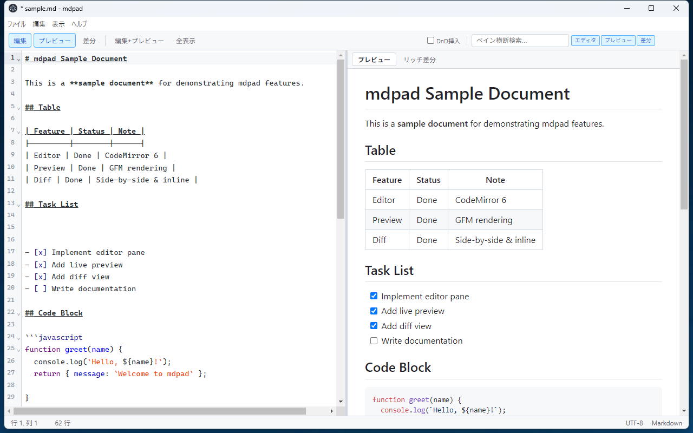
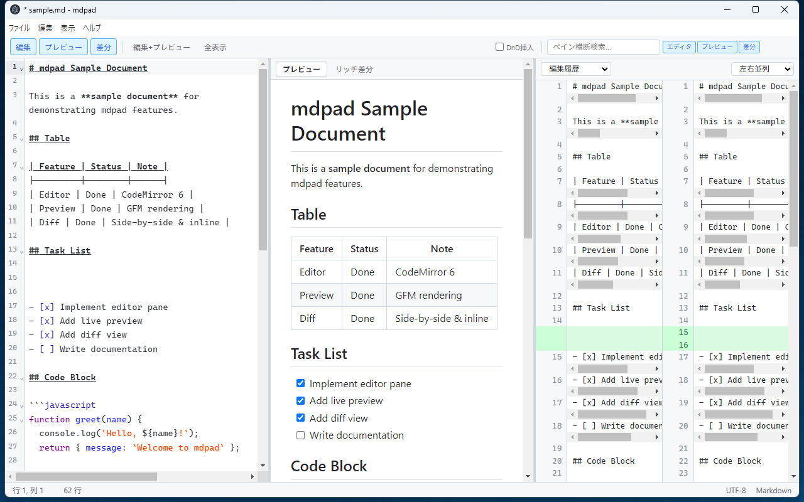
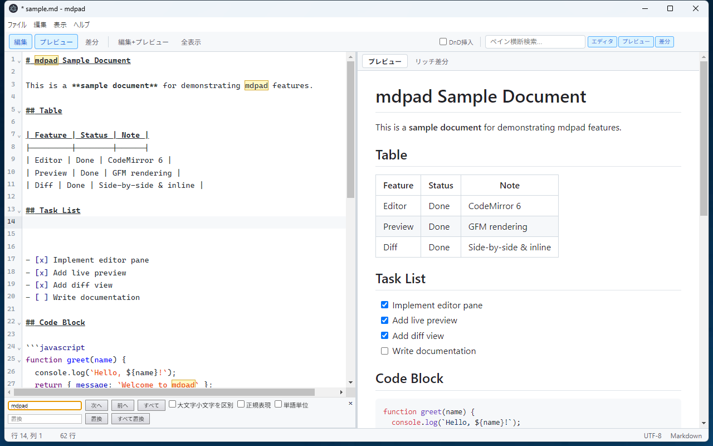
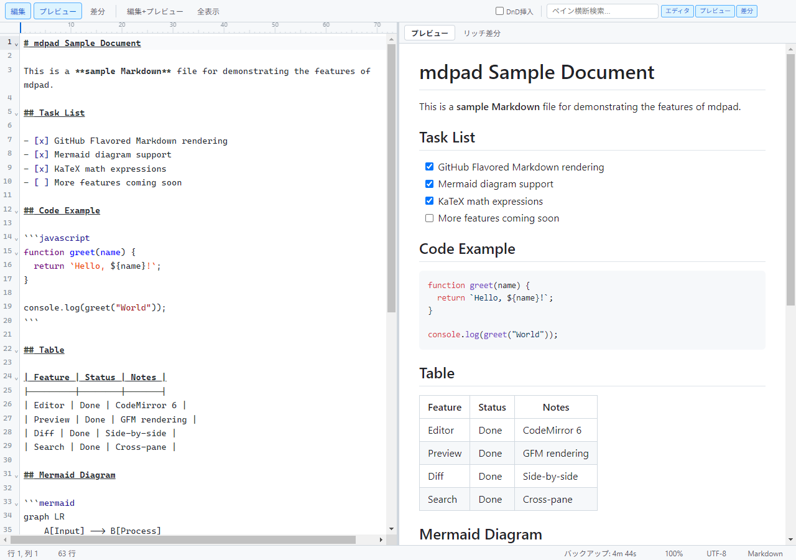

<p align="center">
  
</p>

# mdpad ユーザーガイド

GitHub準拠 Markdownエディタ **mdpad** の使い方を解説します。

---

## 目次

1. [はじめに](#はじめに)
2. [インストールと起動](#インストールと起動)
   - [ポータブル版のダウンロードと実行](#ポータブル版のダウンロードと実行)
   - [ソースからビルド](#ソースからビルド)
3. [画面構成](#画面構成)
   - [ツールバー](#ツールバー)
   - [エディタペイン](#エディタペイン)
   - [プレビューペイン](#プレビューペイン)
   - [差分ペイン](#差分ペイン)
   - [ステータスバー](#ステータスバー)
4. [基本操作](#基本操作)
5. [エディタの使い方](#エディタの使い方)
6. [プレビューペイン詳細](#プレビューペイン詳細)
7. [差分ペイン詳細](#差分ペイン詳細)
8. [レイアウト切り替え](#レイアウト切り替え)
9. [検索・置換](#検索置換)
10. [ペイン横断検索](#ペイン横断検索)
11. [ドラッグ&ドロップ](#ドラッグドロップ)
12. [自動バックアップ](#自動バックアップ)
13. [クラッシュリカバリ](#クラッシュリカバリ)
14. [言語切り替え](#言語切り替え)
15. [キーボードショートカット一覧](#キーボードショートカット一覧)

---

## はじめに

mdpad は、GitHub Flavored Markdown (GFM) に対応した軽量なデスクトップ向け Markdown エディタです。Electron ベースで動作し、以下の特長があります。

- **リアルタイムプレビュー** -- 編集内容を即座に GFM スタイルで描画
- **差分表示** -- 編集履歴や外部ファイルとの差分を左右並列またはインラインで確認
- **リッチ差分** -- プレビュー上で追加・削除をハイライト表示
- **Mermaid 図 / KaTeX 数式** -- ダイアグラムや数式をプレビューで描画
- **ペイン横断検索** -- エディタ・プレビュー・差分を一括検索
- **自動バックアップとクラッシュリカバリ** -- 作業内容を自動的に保護
- **日本語 / 英語 UI** -- OS ロケールに応じた自動切り替え

---

## インストールと起動

### ポータブル版のダウンロードと実行

1. [リリースページ](https://github.com/pumpCurry/mdpad/releases)から最新の ZIP ファイル (`mdpad-vX.X.XXXXX-win-x64-portable.zip`) をダウンロードします。
2. 任意のフォルダに展開します。
3. 展開先の `mdpad.exe` をダブルクリックして起動します。

インストール作業は不要です。展開したフォルダをそのまま持ち運べるポータブル仕様です。

### ソースからビルド

開発環境で直接ビルドする場合は、Node.js (v18 以上) が必要です。

```bash
# リポジトリをクローン
git clone https://github.com/pumpCurry/mdpad.git
cd mdpad

# 依存パッケージをインストール
npm install

# 開発モードで起動
npm run dev

# ビルド (Windows 向けポータブル版)
npm run build

# ZIP アーカイブを作成
npm run build:zip
```

| コマンド | 内容 |
|---|---|
| `npm run dev` | レンダラーをバンドルして開発モードで起動 |
| `npm run start` | レンダラーをバンドルして通常起動 |
| `npm run build` | electron-builder で Windows 向けビルド |
| `npm run build:zip` | ビルド後に ZIP アーカイブを生成 |

---

## 画面構成

mdpad のウィンドウは、上から順に **ツールバー**、**ペインエリア**（エディタ / プレビュー / 差分）、**ステータスバー** で構成されています。



### ツールバー

画面最上部に配置されるバーです。左側にペインの表示制御ボタン、右側に DnD 挿入トグルとペイン横断検索が並びます。

| 要素 | 説明 |
|---|---|
| **編集** / **プレビュー** / **差分** ボタン | 各ペインの表示・非表示を個別に切り替えます。アクティブなペインは青色で強調されます。 |
| **編集+プレビュー** ボタン | エディタとプレビューの2ペイン表示に切り替えます。 |
| **全表示** ボタン | エディタ・プレビュー・差分の3ペインすべてを表示します。 |
| **DnD挿入** チェックボックス | ドラッグ&ドロップ時の動作を切り替えます（後述）。 |
| **ペイン横断検索** 入力欄 | エディタ・プレビュー・差分を横断してテキストを検索します（後述）。 |

### エディタペイン

CodeMirror 6 ベースのテキストエディタです。Markdown 構文ハイライト、行番号、コード折りたたみ、矩形選択など多彩な編集機能を備えています。

### プレビューペイン

エディタの内容をリアルタイムで GFM スタイルに描画します。「プレビュー」タブと「リッチ差分」タブを切り替えられます。

### 差分ペイン

現在の編集内容と、ファイルを開いた時点の内容または外部ファイルとの差分を表示します。左右並列表示とインライン表示を選択できます。

### ステータスバー

画面最下部に表示され、以下の情報を確認できます。

| 表示項目 | 内容 |
|---|---|
| **行 X, 列 Y** | カーソルの現在位置（行番号と列番号） |
| **(N 選択中)** | テキスト選択中の文字数 |
| **X 行** | ドキュメントの総行数 |
| **バックアップ: Xm XXs** | 次回自動バックアップまでの残り時間（OFFの場合は「バックアップ: OFF」） |
| **100%** | 現在のズーム倍率 |
| **UTF-8** | ファイルのエンコーディング |
| **Markdown** | ファイルタイプ |

---

## 基本操作

### 新規ファイル (Ctrl+N)

メニューの **ファイル > 新規** または `Ctrl+N` で、空の新規ドキュメントを作成します。現在のドキュメントに未保存の変更がある場合は、保存確認ダイアログが表示されます。

### ファイルを開く (Ctrl+O)

メニューの **ファイル > 開く...** または `Ctrl+O` で、ファイル選択ダイアログを開きます。Markdown (.md)、テキスト (.txt)、すべてのファイル (*) から選択できます。

### 保存 (Ctrl+S)

メニューの **ファイル > 保存** または `Ctrl+S` で、現在のファイルを上書き保存します。新規ファイルの場合は「名前を付けて保存」ダイアログが開きます。

### 名前を付けて保存 (Ctrl+Shift+S)

メニューの **ファイル > 名前を付けて保存...** または `Ctrl+Shift+S` で、保存先のファイル名とパスを指定して保存します。

### 閉じる時の保存確認ダイアログ

未保存の変更がある状態でウィンドウを閉じようとすると、HTML ベースの保存確認ダイアログが表示されます。

| ボタン | 動作 |
|---|---|
| **保存せず終了** | 変更を破棄して終了 |
| **リジューム用に保存して終了** | 次回起動時に復元できるよう、セッションデータを保存して終了 |
| **名前を付けて保存** | ファイルを保存してから終了 |

ダイアログを `Esc` キーで閉じるか、ダイアログ外をクリックした場合は操作がキャンセルされ、ウィンドウは開いたままになります。

---

## エディタの使い方

### Markdown 構文ハイライト

見出し、太字、斜体、リンク、コードブロックなど、Markdown の構文要素が色分けして表示されます。CodeMirror 6 の Markdown 言語サポートにより、ネストされた構文も正確にハイライトされます。

### 行番号とコード折りたたみ

- エディタの左端に**行番号**が表示されます。
- 見出しやコードブロックなどの折りたたみ可能なブロックには、行番号の横に**折りたたみガター** (三角アイコン) が表示されます。クリックするとそのブロックを折りたたんだり展開したりできます。

### 折り返し切替 (Alt+Z)

メニューの **表示 > 折り返しの切替** または `Alt+Z` で、行の折り返し表示を ON/OFF できます。

- **ON（デフォルト）**: 長い行はウィンドウ幅に合わせて自動的に折り返して表示されます。
- **OFF**: 横スクロールが有効になり、長い行はそのまま1行で表示されます。

### 括弧の自動補完

メニューの **表示 > 括弧の自動補完** で ON/OFF を切り替えられます。ON の場合、`(`、`[`、`{`、`` ` ``、`"` などの開き括弧を入力すると、対応する閉じ括弧が自動的に挿入されます。

### 矩形選択 (Alt+ドラッグ)

`Alt` キーを押しながらマウスでドラッグすると、**矩形（カラム）選択**ができます。複数行にまたがる同じ列範囲を一度に選択・編集したい場合に便利です。

### 80桁ルーラー

エディタ上の80桁の位置に、薄い破線の**ルーラー**が縦に表示されます。1行あたりの文字数の目安として活用できます。

---

## プレビューペイン詳細



プレビューペインは、「**プレビュー**」タブと「**リッチ差分**」タブの2つのモードを持ちます。

### プレビュータブ

エディタの Markdown を GitHub Flavored Markdown (GFM) スタイルでリアルタイム描画します。以下の要素に対応しています。

#### GFM 描画

| 要素 | 記法例 |
|---|---|
| テーブル | `\| 列1 \| 列2 \|` で表を作成 |
| タスクリスト | `- [x] 完了` / `- [ ] 未完了` |
| 脚注 | `テキスト[^1]` と `[^1]: 脚注内容` |
| リンクの自動検出 | URL をそのまま記述するとリンクに変換 |
| 見出し / 太字 / 斜体 | 標準的な Markdown 記法 |

#### Mermaid 図

コードブロックの言語指定に `mermaid` を指定すると、Mermaid 記法のダイアグラムが描画されます。

````markdown

````

フローチャート、シーケンス図、ガントチャートなど、Mermaid がサポートする図を利用できます。

#### KaTeX 数式

TeX / LaTeX 記法の数式を KaTeX で描画します。

- **インライン数式**: `$E = mc^2$` のようにドル記号で囲む
- **ディスプレイ数式**: `$$...$$` で囲むとブロックレベルの数式として中央揃えで表示

```markdown
インライン: $\alpha + \beta = \gamma$

ディスプレイ:
$$
\int_{0}^{\infty} e^{-x^2} dx = \frac{\sqrt{\pi}}{2}
$$
```

#### コードブロックのシンタックスハイライト

コードブロックに言語名を指定すると、highlight.js によるシンタックスハイライトが適用されます。JavaScript、Python、Rust など多数の言語に対応しています。

````markdown
```python
def hello():
    print("Hello, World!")
```
````

#### スクロール同期

エディタペインをスクロールすると、プレビューペインも連動してスクロールします。エディタで編集中の箇所がプレビューのどの位置に対応するかを直感的に把握できます。

### リッチ差分タブ

「**リッチ差分**」タブに切り替えると、Markdown を描画した状態で変更箇所がハイライト表示されます。追加されたテキストは緑色、削除されたテキストは赤色の打ち消し線で表示されます。

#### 比較元の選択

リッチ差分タブでは、比較元を以下の2つから選択できます。

| 選択肢 | 説明 |
|---|---|
| **元の内容と比較** | ファイルを開いた時点の内容と現在の編集内容を比較します。 |
| **ファイルと比較** | 外部ファイルを指定して、そのファイルの内容と現在の編集内容を比較します。「ファイルを開く...」ボタンで比較対象のファイルを選択します。 |

---

## 差分ペイン詳細


差分ペインは、テキストレベルの差分を行単位で詳細に表示します。追加行は緑色、削除行は赤色、行内の変更部分はさらに濃い色でハイライトされます。

### 編集履歴モード

ドロップダウンで「**編集履歴**」を選択すると、ファイルを開いた時点の内容と現在の編集内容の差分が表示されます。新規ファイルの場合は、空の状態からの差分が表示されます。

### ファイル比較モード

ドロップダウンで「**ファイル比較**」を選択すると、外部ファイルとの差分を表示できます。「**ファイルを開く...**」ボタンをクリックして比較対象のファイルを選択してください。

### 左右並列表示 / インライン表示

右側のドロップダウンで表示形式を切り替えられます。

| 表示形式 | 説明 |
|---|---|
| **左右並列** | 変更前（左）と変更後（右）を横に並べて表示します。広い画面で差分を対比しやすい形式です。 |
| **インライン** | 変更前と変更後を上下に連続して表示します。画面幅が狭い場合やシンプルに変更を追いたい場合に便利です。 |

---

## レイアウト切り替え

### ペインボタンによる切り替え

ツールバーの **編集** / **プレビュー** / **差分** ボタンをクリックすると、対応するペインの表示・非表示を個別にトグルできます。少なくとも1つのペインは常に表示された状態が維持されます。

### プリセットレイアウト

| ボタン | 表示構成 |
|---|---|
| **編集+プレビュー** | エディタとプレビューの2ペイン表示 |
| **全表示** | エディタ・プレビュー・差分の3ペイン表示 |

### キーボードショートカット

| ショートカット | 動作 |
|---|---|
| `Ctrl+1` | エディタペインの表示切替 |
| `Ctrl+2` | プレビューペインの表示切替 |
| `Ctrl+3` | 差分ペインの表示切替 |

### リサイズハンドル

隣接するペインの境界にある**リサイズハンドル**（細い縦線）をドラッグすると、各ペインの幅を自由に調整できます。ハンドルにカーソルを合わせると左右矢印のカーソルに変わります。

---

## 検索・置換



### 検索パネルを開く (Ctrl+F)

メニューの **編集 > 検索...** または `Ctrl+F` で、エディタ上部に検索パネルが表示されます。

### 置換パネルを開く (Ctrl+H)

メニューの **編集 > 置換...** または `Ctrl+H` で、検索パネルに加えて置換欄が表示されます。

### 検索オプション

検索パネルには以下のオプションがあります。

| オプション | 説明 |
|---|---|
| **大文字小文字を区別** (match case) | ON にすると大文字・小文字を区別して検索します。 |
| **正規表現** (regexp) | ON にすると検索文字列を正規表現として解釈します。 |
| **単語単位** (by word) | ON にすると単語の境界でのみマッチします。 |

### マッチ数表示

検索語を入力すると、パネル内に現在のマッチ数が「**X 件**」の形式で表示されます。マッチが0件の場合は赤色で表示されます。

### 置換フィードバック

置換を実行すると、パネル内に「**X件置き換えました。 Y 件**」の形式で置換結果がフィードバック表示されます。このメッセージは5秒後に通常のマッチ数表示に戻ります。

### 検索パネルの操作

| ボタン / キー | 動作 |
|---|---|
| **次へ** | 次のマッチに移動 |
| **前へ** | 前のマッチに移動 |
| **置換** | 現在のマッチを置換 |
| **すべて置換** | すべてのマッチを一括置換 |
| **閉じる** | 検索パネルを閉じる |
| `Escape` | 検索パネルを閉じる |

---

## ペイン横断検索



### 概要

ツールバー右側にある**ペイン横断検索**入力欄にテキストを入力すると、エディタ・プレビュー・差分の各ペインを横断して検索し、マッチ箇所を黄色でハイライト表示します。

### スコープ切替ボタン

検索入力欄の右側にある **エディタ** / **プレビュー** / **差分** のトグルボタンで、検索対象のペインを個別に ON/OFF できます。少なくとも1つのペインは常に検索対象として選択された状態が維持されます。

### ハイライト表示と件数表示

- マッチ箇所は各ペインで黄色の背景色でハイライトされます。
- 検索欄の右端に合計マッチ件数が「**X 件**」で表示されます。
- マッチが0件の場合は「**結果なし**」と赤色で表示されます。

### 操作

- テキストを入力すると自動的に検索が実行されます。
- `Escape` キーを押すと検索文字列がクリアされ、ハイライトが解除されます。
- 検索は大文字・小文字を区別しません。

---

## ドラッグ&ドロップ

mdpad では、ファイルをウィンドウにドラッグ&ドロップして操作できます。動作はツールバーの **DnD挿入** チェックボックスで切り替わります。

### デフォルト (DnD挿入 OFF)

DnD挿入チェックボックスが **OFF** の場合（デフォルト）、ウィンドウのどこにファイルをドロップしても、そのファイルが**新しいウィンドウ**で開かれます。

### DnD挿入 ON

DnD挿入チェックボックスを **ON** にすると、ドロップ先によって動作が変わります。

| ドロップ先 | 動作 |
|---|---|
| エディタペイン上 | ファイルの内容がカーソル位置（またはドロップ位置）にテキストとして**挿入**されます。 |
| エディタ以外（プレビュー、差分、ツールバーなど） | ファイルが新しいウィンドウで開かれます。 |

### トグルの場所

DnD挿入トグルは、ツールバー右側のペイン横断検索入力欄の左隣にあるチェックボックスです。ツールチップには「ON: エディタにドロップで内容挿入 / OFF: ドロップでファイルを開く」と表示されます。

---

## 自動バックアップ

mdpad には定期的にエディタの内容をバックアップファイルに保存する機能があります。元のファイルを上書きせず、一時ファイルとして保存されるため安全です。

### 設定方法

メニューの **ファイル > 自動バックアップ** サブメニューからバックアップ間隔を選択します。

| 設定値 | 説明 |
|---|---|
| **OFF** | 自動バックアップを無効にします |
| **1分** / **2分** / **3分** / **5分** / **10分** / **15分** / **30分** / **60分** | 指定した間隔で自動バックアップを実行します |

デフォルトは **5分** に設定されています。設定は `mdpad-config.json` に保存され、次回起動時にも引き継がれます。

### 仕組み

- バックアップは `userData/autosave/` フォルダに PID ベースのファイル名 (`autosave-<PID>.json`) で保存されます。
- PID ベースのため、mdpad を複数ウィンドウで同時に使用しても、各インスタンスのバックアップが干渉しません。
- 保存が正常に完了した場合や、ウィンドウを正常に閉じた場合は、バックアップファイルは自動的に削除されます。
- 未保存の変更がある場合のみバックアップが実行されます。

---

## クラッシュリカバリ

mdpad には、予期しない終了（クラッシュや強制終了）からの復元機能があります。

### セッション自動保存

通常の自動バックアップとは別に、5秒間隔で軽量なセッション情報 (`sessions/session-<PID>.json`) が保存されています。これにより、自動バックアップが OFF の状態でも、クラッシュ時の復元が可能です。

### 復元の流れ

1. mdpad を起動すると、起動時にセッションファイルとバックアップファイルの中から、現在実行中でないプロセスの孤立ファイルを自動的に検出します。
2. 孤立ファイルが見つかった場合、**復元ダイアログ**が表示されます。
3. ダイアログで「OK」を選択すると、前回の編集内容が復元されます。
4. 「キャンセル」を選択すると、孤立ファイルは削除され、空の状態で起動します。

自動バックアップのデータが利用可能な場合はそちらが優先されます（差分表示に必要な元のファイル内容も含まれるため）。

---

## 言語切り替え

### メニューからの切り替え

メニューの **表示 > 言語** サブメニューから、以下の言語を選択できます。

| 言語 | 表示名 |
|---|---|
| 日本語 | 日本語 |
| English | English |

言語を切り替えると、メニュー、ツールバー、検索パネル、差分ペイン、プレビューペイン、ステータスバーなど、UI のすべてのテキストが即座に切り替わります。

### OS ロケール自動検出

初回起動時に OS のロケール設定を自動検出し、対応する言語が選択されます。日本語環境では自動的に日本語 UI で起動します。手動で変更した設定は保存され、次回以降も維持されます。

---

## キーボードショートカット一覧

### ファイル操作

| ショートカット | 動作 |
|---|---|
| `Ctrl+N` | 新規ファイル |
| `Ctrl+O` | ファイルを開く |
| `Ctrl+S` | 保存（上書き保存） |
| `Ctrl+Shift+S` | 名前を付けて保存 |
| `Alt+F4` | 終了 |

### 編集操作

| ショートカット | 動作 |
|---|---|
| `Ctrl+Z` | 元に戻す (Undo) |
| `Ctrl+Y` | やり直し (Redo) |
| `Ctrl+X` | 切り取り |
| `Ctrl+C` | コピー |
| `Ctrl+V` | 貼り付け |
| `Ctrl+A` | すべて選択 |
| `Tab` | インデント |
| `Shift+Tab` | インデント解除 |

### 検索・置換

| ショートカット | 動作 |
|---|---|
| `Ctrl+F` | 検索パネルを開く |
| `Ctrl+H` | 置換パネルを開く |
| `Escape` | 検索パネルを閉じる |

### 表示切替

| ショートカット | 動作 |
|---|---|
| `Ctrl+1` | エディタペインの表示切替 |
| `Ctrl+2` | プレビューペインの表示切替 |
| `Ctrl+3` | 差分ペインの表示切替 |
| `Alt+Z` | 折り返し表示の切替 |

### ズーム

| ショートカット | 動作 |
|---|---|
| `Ctrl+=` (`Ctrl++`) | 拡大 |
| `Ctrl+-` | 縮小 |
| `Ctrl+0` | ズームをリセット |

### エディタ操作

| ショートカット | 動作 |
|---|---|
| `Alt+ドラッグ` | 矩形選択（カラム選択） |
| `Ctrl+/` | 行コメントの切替 |
| `Ctrl+Shift+[` | コードブロックの折りたたみ |
| `Ctrl+Shift+]` | コードブロックの展開 |

### その他

| ショートカット | 動作 |
|---|---|
| `F12` | 開発者ツールの切替 |
