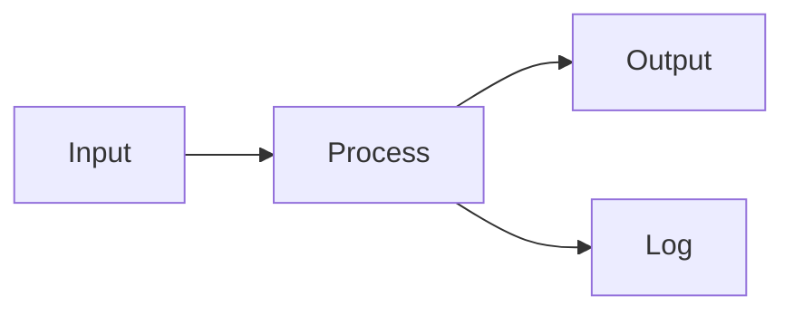

# mdpad Sample Document

This is a **sample Markdown** file for demonstrating the features of mdpad.

## Task List

- [x] GitHub Flavored Markdown rendering
- [x] Mermaid diagram support
- [x] KaTeX math expressions
- [ ] More features coming soon

## Code Example

```javascript
function greet(name) {
  return `Hello, ${name}!`;
}

console.log(greet("World"));
```

## Table

| Feature | Status | Notes |
|---------|--------|-------|
| Editor | Done | CodeMirror 6 |
| Preview | Done | GFM rendering |
| Diff | Done | Side-by-side |
| Search | Done | Cross-pane |

## Mermaid Diagram



## Math Expression

Inline math: $E = mc^2$

Display math:

$$
\int_{0}^{\infty} e^{-x^2} dx = \frac{\sqrt{\pi}}{2}
$$

## Blockquote

> mdpad is a lightweight, portable Markdown editor
> built with Electron and CodeMirror 6.

## Links

- [mdpad on GitHub](https://github.com/pumpCurry/mdpad)
- [Developer Site](https://542.jp/)

---

*End of sample document*
